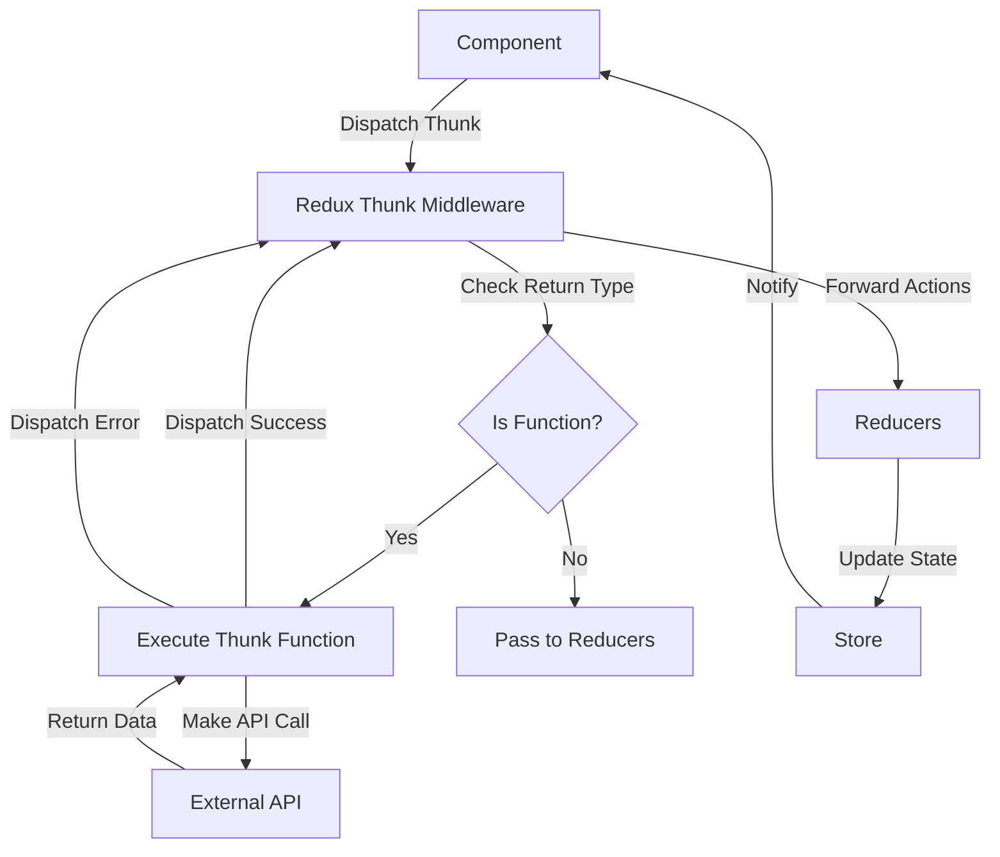

## Core Concepts

### What is Redux Thunk?

Redux Thunk is a middleware that extends Redux's store's abilities, allowing you to write action creators that return functions instead of objects. This enables handling of asynchronous operations in a predictable way.

### Why Use Redux Thunk?

- Simple implementation
- No boilerplate code
- Easy to understand and use
- Built-in Redux ecosystem

### Redux Thunk Flow



## Implementation

### Basic Setup

```javascript
// store.js
import { createStore, applyMiddleware } from 'redux';
import thunk from 'redux-thunk';
import rootReducer from './reducers';

const store = createStore(
  rootReducer,
  applyMiddleware(thunk)
);

export default store;
```

### Basic Thunk Action

```javascript
// actions.js
export const fetchItems = () => {
  return dispatch => {
    dispatch({ type: 'FETCH_ITEMS_REQUEST' });
    
    return fetch('/api/items')
      .then(response => response.json())
      .then(data => dispatch({ type: 'FETCH_ITEMS_SUCCESS', payload: data }))
      .catch(error => dispatch({ type: 'FETCH_ITEMS_FAILURE', payload: error }));
  };
};
```

### Reducer Setup

```javascript
// reducers.js
const initialState = {
  items: [],
  loading: false,
  error: null
};

export default function reducer(state = initialState, action) {
  switch (action.type) {
    case 'FETCH_ITEMS_REQUEST':
      return { ...state, loading: true, error: null };
    case 'FETCH_ITEMS_SUCCESS':
      return { ...state, loading: false, items: action.payload };
    case 'FETCH_ITEMS_FAILURE':
      return { ...state, loading: false, error: action.payload };
    default:
      return state;
  }
}
```

## Advanced Usage

### Complex Thunk Actions

```javascript
// actions.js
export const addItem = (item) => {
  return (dispatch, getState) => {
    // Access current state
    const currentState = getState();
    
    // Make API call
    return fetch('/api/items', {
      method: 'POST',
      body: JSON.stringify(item)
    })
    .then(response => response.json())
    .then(data => {
      // Dispatch success action
      dispatch({ type: 'ADD_ITEM_SUCCESS', payload: data });
      
      // Dispatch related action
      dispatch(fetchItems());
    })
    .catch(error => {
      dispatch({ type: 'ADD_ITEM_FAILURE', payload: error });
    });
  };
};
```

### Error Handling

```javascript
// actions.js
export const fetchItemsWithRetry = () => {
  return (dispatch, getState) => {
    const maxRetries = 3;
    let retries = 0;
    
    const attemptFetch = () => {
      return fetch('/api/items')
        .then(response => {
          if (!response.ok) {
            throw new Error('Network response was not ok');
          }
          return response.json();
        })
        .then(data => dispatch({ type: 'FETCH_ITEMS_SUCCESS', payload: data }))
        .catch(error => {
          retries++;
          if (retries < maxRetries) {
            return new Promise(resolve => setTimeout(resolve, 1000))
              .then(() => attemptFetch());
          }
          dispatch({ type: 'FETCH_ITEMS_FAILURE', payload: error });
        });
    };
    
    return attemptFetch();
  };
};
```

## Best Practices

### Action Creator Patterns

- Always return a value from thunks
- Use async/await for cleaner code
- Handle errors appropriately
- Keep thunks focused and single-purpose

### State Management

- Use loading states for async operations
- Implement error states
- Clean up resources in catch blocks
- Use selectors for derived data

### Component Integration

```javascript
// components/ItemList.js
import { useDispatch, useSelector } from 'react-redux';
import { fetchItems } from '../actions';

function ItemList() {
  const dispatch = useDispatch();
  const { items, loading, error } = useSelector(state => state);

  useEffect(() => {
    dispatch(fetchItems());
  }, [dispatch]);

  if (loading) return <div>Loading...</div>;
  if (error) return <div>Error: {error.message}</div>;

  return (
    <div>
      {items.map(item => (
        <div key={item.id}>{item.name}</div>
      ))}
    </div>
  );
}
```

## Common Pitfalls

### Avoid These Mistakes

1. Not returning dispatch calls
2. Not handling errors
3. Mixing sync and async logic
4. Not cleaning up resources

### Best Solutions

1. Always return from thunks
2. Use try/catch blocks
3. Keep actions focused
4. Use cleanup functions

## Alternatives

### Redux Toolkit

```javascript
// itemsSlice.js
import { createSlice, createAsyncThunk } from '@reduxjs/toolkit';

export const fetchItems = createAsyncThunk(
  'items/fetchItems',
  async () => {
    const response = await fetch('/api/items');
    return response.json();
  }
);

const itemsSlice = createSlice({
  name: 'items',
  initialState: {
    items: [],
    loading: false,
    error: null
  },
  reducers: {},
  extraReducers: (builder) => {
    builder
      .addCase(fetchItems.pending, (state) => {
        state.loading = true;
      })
      .addCase(fetchItems.fulfilled, (state, action) => {
        state.loading = false;
        state.items = action.payload;
      })
      .addCase(fetchItems.rejected, (state, action) => {
        state.loading = false;
        state.error = action.error.message;
      });
  }
});
```

## Getting Started

Install Redux Thunk
```bash
npm install redux-thunk
```

Set up the store
```javascript
// store.js
import { configureStore } from '@reduxjs/toolkit';
import thunk from 'redux-thunk';
import rootReducer from './reducers';

const store = configureStore({
  reducer: {
    items: rootReducer
  },
  middleware: [thunk]
});

export default store;
```

Create your first thunk
```javascript
// actions.js
export const fetchItems = () => {
  return async (dispatch) => {
    try {
      dispatch({ type: 'FETCH_ITEMS_REQUEST' });
      const response = await fetch('/api/items');
      const data = await response.json();
      dispatch({ type: 'FETCH_ITEMS_SUCCESS', payload: data });
    } catch (error) {
      dispatch({ type: 'FETCH_ITEMS_FAILURE', payload: error });
    }
  };
};
```

Remember to always handle errors, use async/await for cleaner code, and keep your thunks focused on single responsibilities. Start with simple thunks and gradually move to more complex patterns as your application grows.