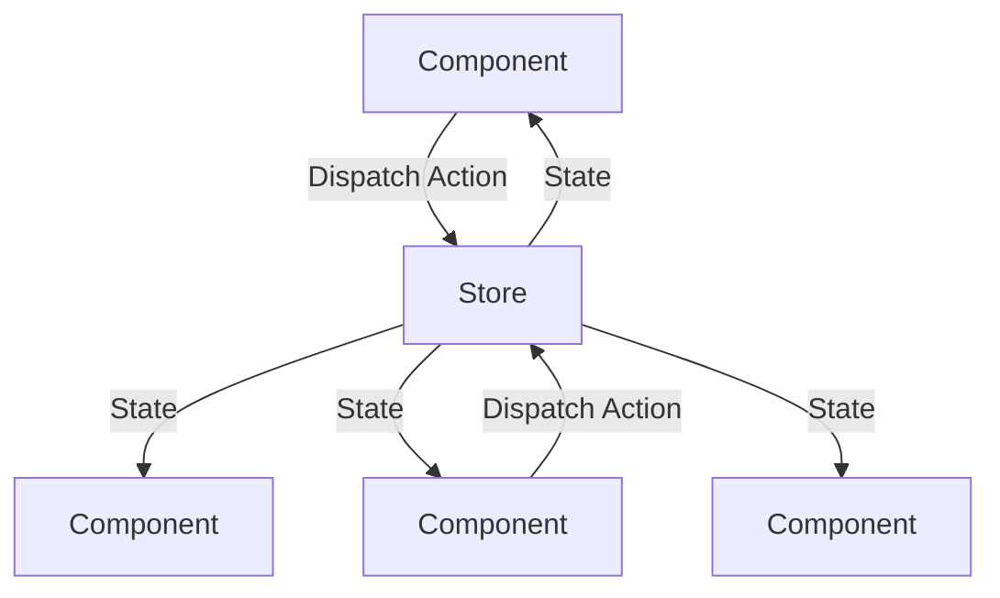

## Core Concepts

### What is Redux?

Redux is a predictable state container for JavaScript applications that helps manage global state by providing a single source of truth for state management.

### Key Components

- Store: The central location that holds the entire application state
- Actions: Payloads that trigger state changes
- Reducers: Pure functions that handle state updates
- Dispatch: The mechanism to send actions to the store

### Redux Flow



## Implementation

### Basic Setup

```javascript
// store.js
import { createStore } from 'redux';
import rootReducer from './reducers';

const store = createStore(rootReducer);

export default store;
```

### Action Creators

```javascript
// actions.js
export const ADD_ITEM = 'ADD_ITEM';
export const REMOVE_ITEM = 'REMOVE_ITEM';

export const addItem = (item) => ({
  type: ADD_ITEM,
  payload: item
});

export const removeItem = (id) => ({
  type: REMOVE_ITEM,
  payload: id
});
```

### Reducers

```javascript
// reducers.js
const initialState = {
  items: [],
  loading: false,
  error: null
};

export default function reducer(state = initialState, action) {
  switch (action.type) {
    case 'ADD_ITEM':
      return {
        ...state,
        items: [...state.items, action.payload]
      };
    case 'REMOVE_ITEM':
      return {
        ...state,
        items: state.items.filter(item => item.id !== action.payload)
      };
    default:
      return state;
  }
}
```

## Advanced Concepts

### Middleware

```javascript
// store.js
import { createStore, applyMiddleware } from 'redux';
import thunk from 'redux-thunk';

const store = createStore(
  rootReducer,
  applyMiddleware(thunk)
);
```

### Async Actions

```javascript
// actions.js
export const fetchItems = () => {
  return dispatch => {
    dispatch({ type: 'FETCH_ITEMS_REQUEST' });
    
    return fetch('/api/items')
      .then(response => response.json())
      .then(data => dispatch({ type: 'FETCH_ITEMS_SUCCESS', payload: data }))
      .catch(error => dispatch({ type: 'FETCH_ITEMS_FAILURE', payload: error }));
  };
};
```

## Best Practices

### State Management

- Keep state minimal and normalized
- Use immutable state updates
- Avoid deep nesting in state
- Use selectors for derived data

### Action Design

- Use FSA (Flux Standard Action) format
- Keep actions serializable
- Use action creators
- Document action types

### Component Integration

```javascript
import { useSelector, useDispatch } from 'react-redux';

function ItemList() {
  const items = useSelector(state => state.items);
  const dispatch = useDispatch();
  
  return (
    <div>
      {items.map(item => (
        <div key={item.id}>
          {item.name}
          <button onClick={() => dispatch(removeItem(item.id))}>
            Remove
          </button>
        </div>
      ))}
    </div>
  );
}
```

## Tools and Ecosystem

### Redux Toolkit

```javascript
// store.js
import { configureStore } from '@reduxjs/toolkit';
import itemReducer from './features/items/itemsSlice';

export const store = configureStore({
  reducer: {
    items: itemReducer
  }
});
```

### DevTools

- Redux DevTools Extension
- Time travel debugging
- State inspection
- Action replay

## Common Patterns

### Selector Pattern

```javascript
// selectors.js
export const getTotal = state => 
  state.items.reduce((sum, item) => sum + item.price, 0);

export const getVisibleItems = state => {
  const { filter, items } = state;
  return items.filter(item => 
    item.name.toLowerCase().includes(filter.toLowerCase())
  );
};
```

### Memoization

```javascript
import { createSelector } from '@reduxjs/toolkit';

export const getTotal = createSelector(
  state => state.items,
  items => items.reduce((sum, item) => sum + item.price, 0)
);
```

## Performance Optimization

### Memoization Techniques

- Use `createSelector` for derived data
- Implement `React.memo` for components
- Use `useCallback` for event handlers
- Implement `areEqual` for custom comparisons

### State Normalization

```javascript
// Normalized state
const state = {
  entities: {
    items: {
      1: { id: 1, name: 'Item 1' },
      2: { id: 2, name: 'Item 2' }
    }
  },
  result: [1, 2]
};
```

## Best Resources

### Official Documentation

- Redux.js.org
- Redux Toolkit Documentation
- Redux GitHub Repository

### Learning Resources

- Redux Tutorial by Dan Abramov
- Redux.js.org Tutorials
- Redux Toolkit Tutorial

### Community Resources

- Redux Subreddit
- Stack Overflow Redux Tag
- Redux Discord

## Getting Started

Install Redux Toolkit```bash
npm install @reduxjs/toolkit react-redux
```

Set up the store```javascript
// store.js
import { configureStore } from '@reduxjs/toolkit';
import counterReducer from './features/counter/counterSlice';

export const store = configureStore({
  reducer: {
    counter: counterReducer
  }
});
```

Connect your app```javascript
// App.js
import { Provider } from 'react-redux';
import { store } from './store';

function App() {
  return (
    <Provider store={store}>
      <Counter />
    </Provider>
  );
}
```

Remember to follow the single responsibility principle, keep your actions and reducers pure, and use Redux Toolkit for modern Redux development. Start with basic concepts and gradually move to advanced patterns as your application grows.